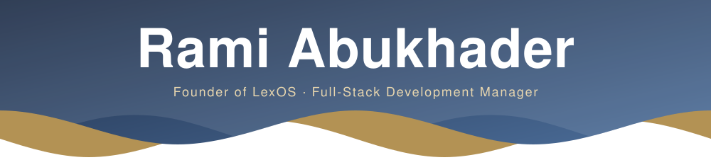

<!-- Animated tagline — typing SVG in brass (#b08d4c), IBM Plex Sans to echo LexOS -->

&nbsp;

&nbsp;

---

I'm Rami. I build **LexOS**, a legal office operating system, and engineer enterprise banking processes on Appian. Whether I write the code or direct AI agents to write it, I own the result — **business and engineering, together**.

## 🏗 What I'm building

|  |  |  |
|---|---|---|
| **trylexos.co** | Legal office operating system — multi-tenant, RBAC, audit logging. Arabic-first. `React/TS · ASP.NET Core · PostgreSQL` |  |
| **Appexai.net** | Full-stack platform I led — public site, admin console, and messaging automation on self-managed infrastructure. |  |

## 🧠 How I build with AI

I direct AI coding agents — **Claude Code** and **OpenAI Codex** — to architect, build, test and ship production software end-to-end. **LexOS was delivered solo this way**: multi-tenant backend, Arabic-first RTL interface, offline-verifiable signed licensing, Windows installer, full e2e suite. Agent orchestration is how I work, not an add-on.

- **Spec before code.** Every feature starts as a written decision — scope, constraints, done-criteria. The agent implements the spec; it doesn't invent it.
- **Guardrails, not vibes.** Design tokens are lint-enforced, e2e tests gate the UI, security and review passes run before anything merges — so agent output can't quietly drift.
- **Right agent, right job.** Claude Code for architecture and multi-file surgery; Codex for parallel, well-scoped tasks. They run side by side, not in sequence.
- **Sessions end in handoffs.** Each work session closes with a written brief, so the next one starts with context instead of archaeology.
- **The business decisions stay mine.** Pricing, licensing model, jurisdiction and legal-source rules are decided by me — the code only enforces them.

## 🏦 Where I go deep

Enterprise banking process engineering — user and entitlement management, case handling, compliance and AML flows, integrations between core systems, and the audit trails regulators actually ask for. That domain is why LexOS has real RBAC and immutable audit logging instead of a login page and good intentions.

## ⚙️ Stack

## 🧭 Now

`LexOS V1 feature-complete on .NET 10` · `hardening the release & installer pipeline` · `Arabic-first RTL end to end`

## 📫 Connect

📍 Ramallah, Palestine &nbsp;·&nbsp; ✉️ [rami.khaderr@gmail.com](mailto:rami.khaderr@gmail.com) &nbsp;·&nbsp; 🔗 [LinkedIn](https://www.linkedin.com/in/rami-abukhader/)
